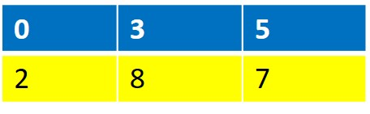

# numpy 學習主題
```
1.資料型態 ==> N-Dimensional Arrays(ndarray)
ndarray的屬性: 軸(axis)|維度(dimension):ndim|秩rank |形狀(shape):shape|dtype(資料型態:data type)

2.基本運算1: 建立各式各樣的ndarray
基本運算2: ndarray的基本運算:切片 (Slicing) , 搜尋(找出滿足條件的資料),排序,.....
基本運算3: ndarray的基本數學運算:四則運算,
基本運算4: ndarray的基本統計運算 ==> 進階功能請參閱python統計書籍
基本運算5: ndarray的(線性代數)數學運算

3.特殊運算 ==> 陣列擴張|廣播 (Broadcasting)
```


## 資料型態 ==> N-Dimensional Arrays(ndarray)

## ndarray的屬性: 
- 軸(axis)|維度(dimension):ndim|秩rank |形狀(shape):shape|dtype(資料型態:data type)| 大小(元素個數):size

#### ndarray的屬性:軸(axis)
- [numpy axis概念整理筆記](http://changtw-blog.logdown.com/posts/895468-python-numpy-axis-concept-organize-notes)

#### ndarray的屬性:維度(dimension):ndim
```
import numpy as np

ar2=np.array([[0,3,5],[2,8,7]]) # 產生一個 2D array
ar2.ndim
```

#### ndarray的屬性:秩rank
#### ndarray的屬性:形狀(shape):shape
```
import numpy as np

ar2=np.array([[0,3,5],[2,8,7]]) # 產生一個 2D array
ar2.shape
```
#### ndarray的屬性:大小(元素個數):size
```
import numpy as np

ar2=np.array([[0,3,5],[2,8,7]]) # 產生一個 2D array
ar2.size
```
#### ndarray的屬性:[dtype(資料型態:data type)](https://www.runoob.com/numpy/numpy-dtype.html)
```
import numpy as np

ar1=np.array([2,4,6,8]); 
ar1.dtype
```
```
ar2=np.array([2,-1,6,3], dtype='float’ ); 
ar2
ar2.dtype
```

```
import numpy as np

ar3=np.array([2.,4,6,8]); 

ar3.dtype
```

### 作業:[numpy.array的說明](https://numpy.org/doc/stable/reference/generated/numpy.array.html)
#### ndarray的運算:型態轉換|astype()函式
```
f_ar = np.array([13,-3,8.88])
f_ar
```
```
intf_ar=f_ar.astype(int)
intf_ar
```

# 2.基本運算1: 建立各式各樣的ndarray [完成底下函式的說明]
- 建立元素都是 0/1 的陣列 – zeros()/ones()
- 建立「不限定元素值」的陣列 – empty()
- 建立identity matrix
- 建立diagonal array
- 建立指定範圍的等差陣列 – arange()
- 建立指定範圍的等差陣列 – linspace()
- 使用random 模組建立隨機亂數的陣列 

### 建立元素都是 0/1 的陣列 – zeros()/ones()
```
import numpy as np
z1 = np.zeros((2, 3))
z2 = np.ones((2, 3))
z1
```
### 建立「不限定元素值」的陣列 – empty()

### create(建立) identity matrix
```
import numpy as np

ar9a = np.array([[ 1.,  0.,  0.],[ 0.,  1.,  0.],[ 0.,  0.,  1.]]);
ar9a
```
```
import numpy as np

ar9b = np.eye(3);
ar9b
```
### Create(建立) diagonal array
```python
import numpy as np

ar10=np.diag((2,1,4,6));
ar10
```
### 使用numpy.linspace產生陣列
```python
import numpy as np

ar12 = np.linspace(1., 4., 6) # start, end, num
ar12
```
### 建立「不限定元素值」的陣列 – empty()

### 建立指定範圍的等差陣列 – arange()
```python
import numpy as np

ar11=np.arange(2, 3, 0.1) # start, end, step
ar11
```

### 作業
```python
import numpy as np
arr = np.array([range(i, i + 3) for i in [2, 4, 6]])
```
```
arr 
(1)array =?
(2)shape =?
(3)dimension =?
(4)dtype
```

# 2_2.基本運算2:
- 陣列變形 - reshape()、resize()
- 將陣列展平為 1D 陣列 – flatten()/ravel()
- 增加陣列的軸數 – np.newaxis
- 轉置陣列transpose()
- 陣列排序 – sort() 與 argsort()
- 陣列合併 – vstack()、hstack()
- 在陣列最後面加入元素 – append()
- 條件搜尋
  - 判斷陣列真假值 – all()、any()
  - 找出符合條件的元素 – where()
  - 取出最大值、最小值 – amax()、amin()
  - 取出最大值、最小值的索引位置 – argmax()、argmin()
  - 找出不是 0 的元素 – nonzero()

- 陣列的儲存與讀取 – save() 與 load()
- 以文字格式儲存、讀取陣列內容 – savetxt() 與 loadtxt()

###
```python
import numpy as np

# x = np.arange(2,10)
x = np.arange(2,10).reshape(2,4)
x
#x.shape
```


### 作業:下列答案為何? numpy.tile()
- [numpy.tile](https://docs.scipy.org/doc/numpy/reference/generated/numpy.tile.html)

```
np.tile(np.array([[1,2],[6,7]]),3)
np.tile(np.array([[1,2],[6,7]]),(2,2))
```

### 基本運算4: ndarray的基本統計運算 ==> 進階統計功能請參閱python統計書籍
- 計算元素平均值 – average() 與 mean()
- 計算中位數 – median()
- 計算元素總和 – sum()
- 計算標準差 – std()
- 計算變異數 – var()
- 計算共變異數 – cov() 
- 計算相關係數 – corrcoef()


### 基本運算5: ndarray的(線性代數)數學運算
- 點積運算 – dot()
- 計算矩陣的 determinant – linalg.det()
- 計算矩陣的「特徵值」與「特徵向量」 – linalg.eig()
- 計算矩陣的 rank – linalg.matrix_rank()
- 計算矩陣的「反矩陣」 – linalg.inv() 
- 計算張量積 – outer()
- 計算叉積 – cross() 
- 計算卷積 – convolve()
- 將連續值轉換為離散值 – digitize()

## 3.特殊運算 ==> 陣列擴張|廣播 (Broadcasting)
#### [Numpy random模組](https://numpy.org/doc/1.16/reference/routines.random.html)
- Numpy random模組有許多函數(如下),本課程僅交簡單與常用的
```python
import numpy as np
np.random.seed(0) 

x1 = np.random.randint(10, size=6) 
x2 = np.random.randint(10, size=(3, 4)) 
x3 = np.random.randint(10, size=(3, 4, 5))  
```

### (1)Simple random data
```
rand(d0, d1, …, dn)	Random values in a given shape.
randn(d0, d1, …, dn)	Return a sample (or samples) from the “standard normal” distribution.
randint(low[, high, size, dtype])	Return random integers from low (inclusive) to high (exclusive).
random_integers(low[, high, size])	Random integers of type np.int between low and high, inclusive.
random_sample([size])	Return random floats in the half-open interval [0.0, 1.0).
random([size])	Return random floats in the half-open interval [0.0, 1.0).
ranf([size])	Return random floats in the half-open interval [0.0, 1.0).
sample([size])	Return random floats in the half-open interval [0.0, 1.0).
choice(a[, size, replace, p])	Generates a random sample from a given 1-D array
bytes(length)	Return random bytes.
```
## (2)Permutations
```
shuffle(x)	Modify a sequence in-place by shuffling its contents.
permutation(x)	Randomly permute a sequence, or return a permuted range.
```
### (3)Distributions
```
beta(a, b[, size])	Draw samples from a Beta distribution.
binomial(n, p[, size])	Draw samples from a binomial distribution.
chisquare(df[, size])	Draw samples from a chi-square distribution.
dirichlet(alpha[, size])	Draw samples from the Dirichlet distribution.
exponential([scale, size])	Draw samples from an exponential distribution.
f(dfnum, dfden[, size])	Draw samples from an F distribution.
gamma(shape[, scale, size])	Draw samples from a Gamma distribution.
geometric(p[, size])	Draw samples from the geometric distribution.
gumbel([loc, scale, size])	Draw samples from a Gumbel distribution.
hypergeometric(ngood, nbad, nsample[, size])	Draw samples from a Hypergeometric distribution.
laplace([loc, scale, size])	Draw samples from the Laplace or double exponential distribution with specified location (or mean) and scale (decay).
logistic([loc, scale, size])	Draw samples from a logistic distribution.
lognormal([mean, sigma, size])	Draw samples from a log-normal distribution.
logseries(p[, size])	Draw samples from a logarithmic series distribution.
multinomial(n, pvals[, size])	Draw samples from a multinomial distribution.
multivariate_normal(mean, cov[, size, …)	Draw random samples from a multivariate normal distribution.
negative_binomial(n, p[, size])	Draw samples from a negative binomial distribution.
noncentral_chisquare(df, nonc[, size])	Draw samples from a noncentral chi-square distribution.
noncentral_f(dfnum, dfden, nonc[, size])	Draw samples from the noncentral F distribution.
normal([loc, scale, size])	Draw random samples from a normal (Gaussian) distribution.
pareto(a[, size])	Draw samples from a Pareto II or Lomax distribution with specified shape.
poisson([lam, size])	Draw samples from a Poisson distribution.
power(a[, size])	Draws samples in [0, 1] from a power distribution with positive exponent a - 1.
rayleigh([scale, size])	Draw samples from a Rayleigh distribution.
standard_cauchy([size])	Draw samples from a standard Cauchy distribution with mode = 0.
standard_exponential([size])	Draw samples from the standard exponential distribution.
standard_gamma(shape[, size])	Draw samples from a standard Gamma distribution.
standard_normal([size])	Draw samples from a standard Normal distribution (mean=0, stdev=1).
standard_t(df[, size])	Draw samples from a standard Student’s t distribution with df degrees of freedom.
triangular(left, mode, right[, size])	Draw samples from the triangular distribution over the interval [left, right].
uniform([low, high, size])	Draw samples from a uniform distribution.
vonmises(mu, kappa[, size])	Draw samples from a von Mises distribution.
wald(mean, scale[, size])	Draw samples from a Wald, or inverse Gaussian, distribution.
weibull(a[, size])	Draw samples from a Weibull distribution.
zipf(a[, size])	Draw samples from a Zipf distribution.
```
### (4)Random generator
```
RandomState([seed])	Container for the Mersenne Twister pseudo-random number generator.
seed([seed])	Seed the generator.
get_state()	Return a tuple representing the internal state of the generator.
set_state(state)	Set the internal state of the generator from a tuple.
```


